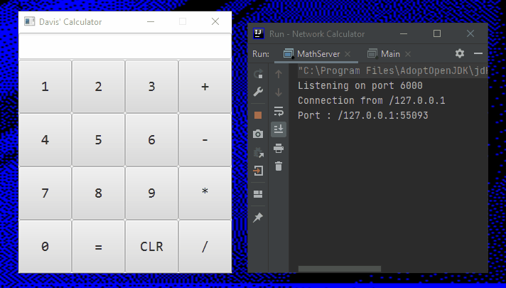

Network Calculator
========================
Created by : Davis Insua

OVERVIEW 
----------------

This is a Java application of a calculator made up of two critical files, the client and the server. The client is a GUI calculator that sends input equations to the server for calculation. The server receives the equation, parses it, calculates the solution, and sends it back to the client GUI to display the answer. The client uses JavaFX to power its interface, Arraylists, and loops to efficiently create GUI elements, and multiple functions to handle the operators and equal sign of the calculator. The server uses core java networking components and java threads to efficiently handle requests from the client and regular expressions to parse given equations. The two source files are explained in more detail below.

MathCalculatorClient.java 
----------------

This is the GUI calculator that communicates with the server. It functions by displaying a calculator interface to the user. When the user enters their desired equation, the main function handleButtonAction is recording the operator and number values entered in memory. Once the user presses the equal sign, the equation string is constructed and sent to the math server for calculation using the handleEqualSign equation. It is then updated with the calculated result by the server in the same equation.

MathServer.java 
----------------

This is the server that the client application connects to. It functions by listening on the defined port (6000) indefinitely for the client to connect. Once the client connects, a client handler thread is started. In this thread, a regular expression pattern is defined to parse the equations sent from the client. Through the thread, the operator is determined, and the string is parsed. The answer is calculated and sent back to the client for display.

USAGE 
----------------

First, the server MathServer.java must be compiled and executed. After that, the main application MathCalculatorClient.java can be run. The client will connect to the server, and the calculator can now be used.

DEMO  
----------------

Demo showing basic functionality of the program. 
